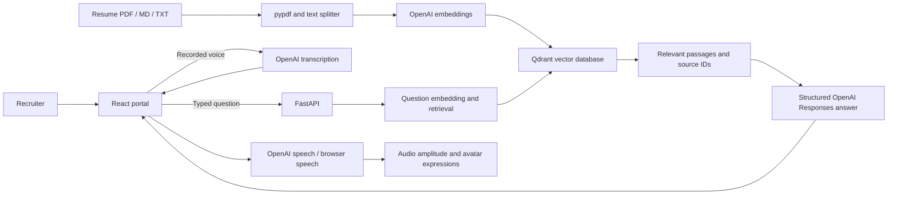

# Architecture

[[Welcome]] | [[Project Plan]] | [[Setup and Deployment]]

Voice transcription and synthesis calls pass through FastAPI; credentials never enter the frontend. The diagram separates these services to show the flow.

## Decisions

| Area | Choice | Reason |
| --- | --- | --- |
| Frontend | React, TypeScript, Vite | Small interactive application with Vercel support |
| Avatar | Procedural Three.js human bust | Owned asset, no external avatar subscription; direct expression control |
| API | FastAPI / Python 3.12 | Typed input validation and practical AI library support |
| Parsing | pypdf layout mode | Keeps this resume's multi-column header and job sections readable |
| Chunking | LangChain recursive splitter, 950 characters / 180 overlap | Compact contexts with passage overlap |
| Vectors | Qdrant, cosine similarity | Embedded persistent development database; optional hosted connection |
| Embeddings | text-embedding-3-small, 1024 dimensions | Configurable semantic retrieval |
| Answers | gpt-4.1-mini, Responses structured output | Answers, supporting source IDs, and support flag in one contract |
| Voice | gpt-4o-mini-transcribe and gpt-4o-mini-tts / ash | Recorded question and synthesized reply |
| Offline development | scikit-learn HashingVectorizer and excerpts | No paid API requirement for mechanical development/tests |

Models are environment settings, not tied to the frontend. Switching embedding models requires ingestion into the corresponding index.

## Evidence And Limits

Retrieval selects up to five relevant passages and includes document/page metadata. Generation receives those passages and bounded conversation history. History resolves follow-ups but is not factual evidence. A structured result must cite existing retrieved IDs; unsupported or invalidly cited answers are replaced with an abstention.

Citation validation cannot prove that every sentence is supported. Prompt injection and hallucination resistance need ongoing evaluation; no "hallucination-free" guarantee is made. Local fallback returns labeled excerpts rather than generating claims.

## Operational Boundaries

Ingestion is a CLI operation. A new generation is embedded and persisted before its manifest replaces the active generation. Embedded Qdrant permits one API process; stop it before a separate ingestion command. Keep the manifest and PDF on persistent storage even if using hosted Qdrant. Multiple replicas need a shared manifest and distributed rate limiter.

Conversations remain in browser memory. Relevant text and audio are sent to configured AI providers. The public resume endpoint exposes the original connected resume by design. See [[Setup and Deployment]] before release.
